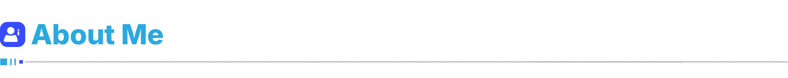
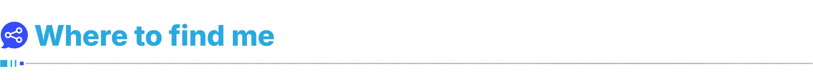
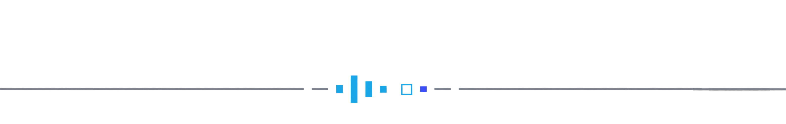

  

  From Québec, Canada 🍁

- 🔭 I’m currently working as a Full-Stack Developer at [Progi](https://progi.com/en/)
- 🌱 Always learning and polishing my AI knowledges and skills
- 🎨 Infographics and stylish UI design fan
- 🧠 Passionate about productivity and optimization
- 👨‍👩‍👧 Building the **EØGAMING** community and brand
- 🎮 Gamer addicted to innovation and creativity

 

  

 

  
  
  
  

